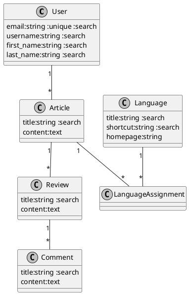

```plantuml
@startuml

skinparam monochrome true
skinparam shadowing false

class User {
  email:string :unique :search
  username:string :search
  first_name:string :search
  last_name:string :search
}

class Article {
  title:string :search
  content:text
}

class Language {
  title:string :search
  shortcut:string :search
  homepage:string
}

class Comment {
  title:string :search
  content:text
}

class Review {
  title:string :search
  content:text
}

User "1" -- "*" Article

Article "1" -- "*" Review
Review "1" -- "*" Comment

Article "1" -- "*" LanguageAssignment
Language "1" -- "*" LanguageAssignment

@enduml
```
