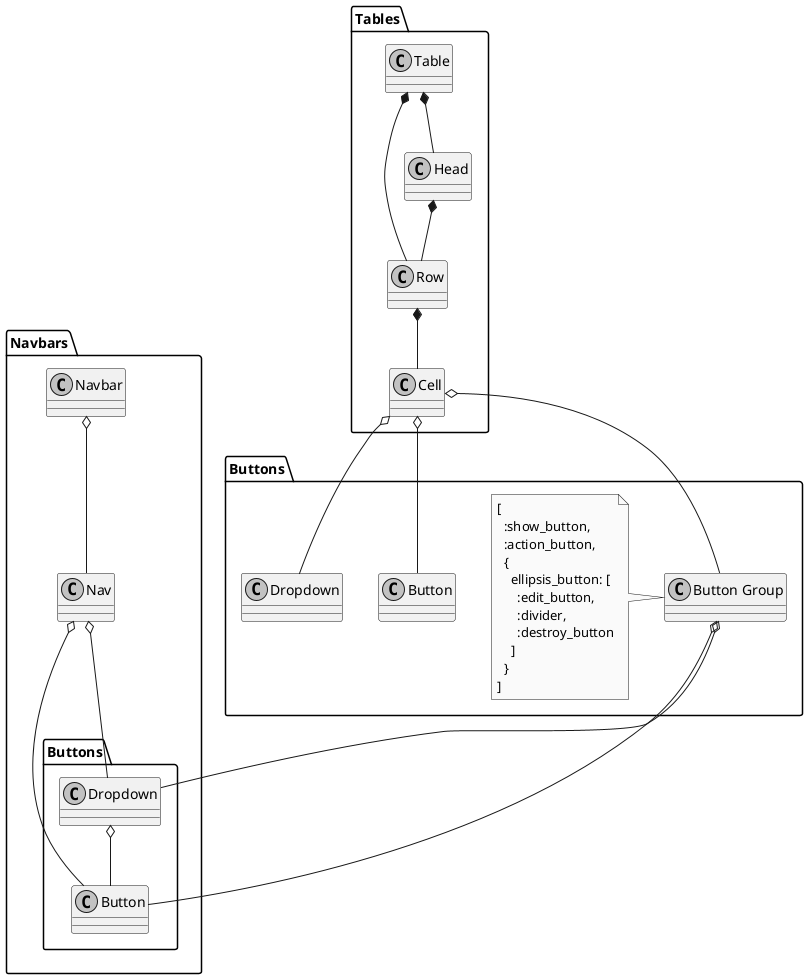

# View components diagram

```plantuml
@startuml

skinparam monochrome true
skinparam shadowing false

namespace Navbars {
  "Navbar" o-- "Nav"

  "Nav" o-- "Buttons.Button"
  "Nav" o-- "Buttons.Dropdown"
}

namespace Buttons {
  "Dropdown" o-- "Button"

  "Button Group" o-- "Button"
  "Button Group" o-- "Dropdown"
  
  note left of "Button Group"
    [
      :show_button,
      :action_button,
      {
        ellipsis_button: [
          :edit_button,
          :divider,
          :destroy_button
        ]
      }
    ]
  end note
}

namespace Tables {
  "Table" *-- "Row"
  "Table" *-- "Head"

  "Head" *-- "Row"

  "Row" *-- "Cell"
}

"Tables.Cell" o-- "Buttons.Button"
"Tables.Cell" o-- "Buttons.Dropdown"
"Tables.Cell" o-- "Buttons.Button Group"

@enduml
```
