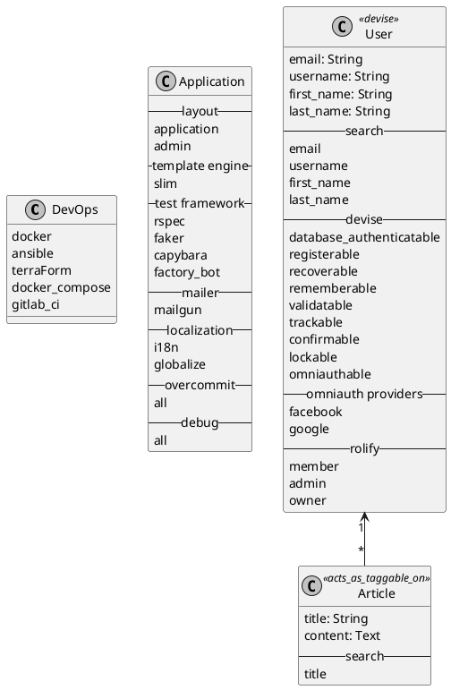

```plantuml
@startuml

skinparam monochrome true
skinparam shadowing false

class DevOps {
  docker
  ansible
  terraForm
  docker_compose
  gitlab_ci
}

class Application {
  -- layout --
  application
  admin
  -- template engine --
  slim
  -- test framework --
  rspec
  faker
  capybara
  factory_bot
  -- mailer --
  mailgun
  -- localization --
  i18n
  globalize
  -- overcommit --
  all
  -- debug --
  all
}

class User <<devise>> {
  email: String
  username: String
  first_name: String
  last_name: String
  -- search --
  email
  username
  first_name
  last_name
  -- devise --
  database_authenticatable
  registerable
  recoverable
  rememberable
  validatable
  trackable
  confirmable
  lockable
  omniauthable
  -- omniauth providers --
  facebook
  google
  -- rolify --
  member
  admin
  owner
}

class Article <<acts_as_taggable_on>> {
  title: String
  content: Text
  -- search --
  title
}

User "1" <-- "*" Article

@enduml
```
