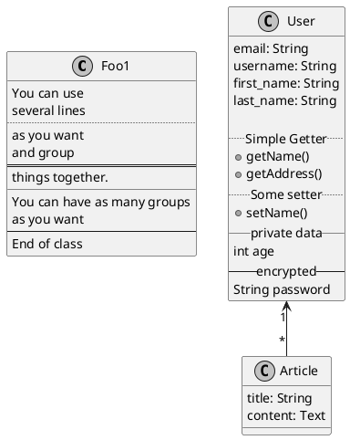

```plantuml
@startuml

skinparam monochrome true
skinparam shadowing false

class Foo1 {
  You can use
  several lines
  ..
  as you want
  and group
  ==
  things together.
  __
  You can have as many groups
  as you want
  --
  End of class
}

class User {
  email: String
  username: String
  first_name: String
  last_name: String

  .. Simple Getter ..
  + getName()
  + getAddress()
  .. Some setter ..
  + setName()
  __ private data __
  int age
  -- encrypted --
  String password
}

class Article {
  title: String
  content: Text
}

User "1" <-- "*" Article

@enduml
```
