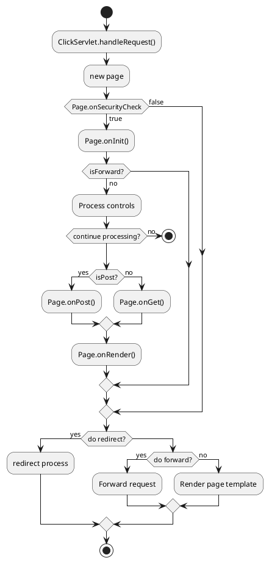

# New rails app generation process

```plantuml
@startuml

skinparam monochrome true
skinparam shadowing false

start
partition "Initial generation" {
  :rails new APP_PATH;
  note right
    --skip-turbolinks
    --skip-test
    --skip-system-test
    --skip-sprockets
    --webpack=stimulus
    --database=postgresql
  end note
  
  :remove redundant gems;
  note right
    tzinfo
  end note
  
  :bundle install;
  
}

:after bundle;
note left
  Including nodejs process
end note

:remove redundant dirs;
note right
  app/assets
end note

:add inserts;
note right
  to tmp
end note

:append_to_file '.gitignore';
note left
  .DS_Store
  .idea
  .env
  .env.*
  /coverage
end note

:format files;
note right
  Remove comments
  Add space after rails gem in Gemfile
end note

partition "Rails linters" {
  :add rails linters gems;
  note left
    Append to Gemfile:
    
    group :development do
      gem 'brakeman'
      gem 'bundler-audit'
      gem 'fasterer'
      gem 'flay'
      gem 'overcommit'
      gem 'rails_best_practices'
      gem 'reek'
      gem 'rubocop', require: false
      gem 'rubocop-rspec', require: false
      gem 'rubycritic', require: false
      gem 'slim_lint'
    end
  end note
  
  :bundle install;
  
  :copy configuration files;
  note right 
    copy_file './files/.flayignore', './'
    copy_file './files/.overcommit.yml', './'
    copy_file './files/.rails_best_practices.yml', './'
    copy_file './files/.reek.yml', './'
    copy_file './files/.rubocop.yml', './'
  end note  
}  


partition "Frontend linters" {
  :install frontend linters;
  note right
    eslint
    eslint-config-airbnb-base
    eslint-config-prettier
    eslint-import-resolver-webpack
    eslint-plugin-import
    eslint-plugin-prettier
    prettier
    stylelint
    stylelint-config-standard
  end note
  
  :copy configuration files;
  note left 
    .eslintr
    .prettierrc.json
    .stylelint.json
  end note
  
  :format files;
  note left 
    fix babel.config.js
    fix postcss.config.js
    add postcss dependencies
  end note
}

partition "Test Suite" {
  :add test gems;
  note left
    Append to Gemfile:
    
    group :development do
      gem 'better_errors' # No config
      gem 'binding_of_caller' # No config
      gem 'letter_opener' # Config
      gem 'pry-awesome_print' # No config
      gem 'pry-rails' # No config
    end
    
    group :development, :test do
      gem 'amazing_print' # No config
      gem 'bullet' # Config
      gem 'factory_bot_rails' # No config
      gem 'faker' # No config
      gem 'pry-byebug' # No config
      gem 'rspec-rails' # Config
    end
    
    group :test do
      gem 'capybara' # Config
      gem 'selenium-webdriver'
      gem 'shoulda-matchers'
      gem 'simplecov', require: false # Config
      gem 'vcr' # Config
      gem 'w3c_validators'
      gem 'webdrivers', require: false
      gem 'webmock'
    end
  end note
  
  :bundle install;
  
  :rails generate rspec:install;
  note right
    DISABLE_SPRING=1
  end note
  
  :format files;
  note left
    spec/rails_helper.rb
    spec/spec_helper.rb
  end note
  
  :install capybara;
  
  :install simplecov;
  
  :install bullet;
  
  :configure rspec to work with tools;
  note left
    copy directory spec/support
  end note
}

partition "Devise" {
  :add test gems;  
  note left
    Append to Gemfile:
    
    gem 'devise'
    gem 'email_validator'
    gem 'omniauth'
    gem 'omniauth-facebook'
    gem 'omniauth-google-oauth2'
    gem 'omniauth-rails_csrf_protection'
    gem 'rolify'
  end note
  
  :bundle install;
  
  :rails generate devise:install;
  
  :remove generated locales;
  
  :copy directory;
  
  :remove comments from devise initializer;
  
  :configure devise initializer;
  
  :rails generate devise User;
  
  :remove comments from user.rb;
  
  :uncomment lines in devise user migration;
  
  :rails generate rolify Role User;
  
  :rails db:migrate;
  
  :uncomment lines in rolify initializer;
  
  :configure User model;
  
  
}

partition "Application configuration" {
  :add Procfile;
  
}

:overcommit --install;

stop

@enduml
```

## Example

```plantuml
@startuml

skinparam monochrome true
skinparam shadowing false

start
:ClickServlet.handleRequest();
:new page;
if (Page.onSecurityCheck) then (true)
  :Page.onInit();
  if (isForward?) then (no)
    :Process controls;
    if (continue processing?) then (no)
      stop
    endif

    if (isPost?) then (yes)
      :Page.onPost();
    else (no)
      :Page.onGet();
    endif
    :Page.onRender();
  endif
else (false)
endif

if (do redirect?) then (yes)
  :redirect process;
else
  if (do forward?) then (yes)
    :Forward request;
  else (no)
    :Render page template;
  endif
endif

stop

@enduml
```