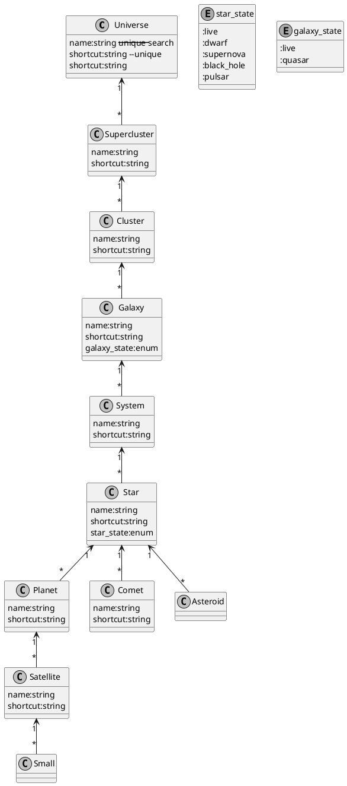

```plantuml
@startuml

skinparam monochrome true
skinparam shadowing false

class Universe {
  name:string --unique --search
  shortcut:string --unique
  shortcut:string
}

class Supercluster {
  name:string
  shortcut:string
}

class Cluster {
  name:string
  shortcut:string
}

class Galaxy {
   name:string
   shortcut:string
   galaxy_state:enum
}

class System {
  name:string
  shortcut:string
} 

class Star {
  name:string
  shortcut:string
  star_state:enum
}

class Planet {
  name:string
  shortcut:string
}

class Comet {
  name:string
  shortcut:string
}

class Satellite {
  name:string
  shortcut:string
}

enum star_state {
  :live
  :dwarf
  :supernova
  :black_hole
  :pulsar
}

enum galaxy_state {
  :live
  :quasar
}

  Universe "1" <-- "*" Supercluster

Supercluster "1" <-- "*" Cluster

Cluster "1" <-- "*" Galaxy

Galaxy "1" <-- "*" System

System "1" <-- "*" Star

Star "1" <-- "*" Planet
Star "1" <-- "*" Comet
Star "1" <-- "*" Asteroid

Planet "1" <-- "*" Satellite
Satellite "1" <-- "*" Small
@enduml
```
