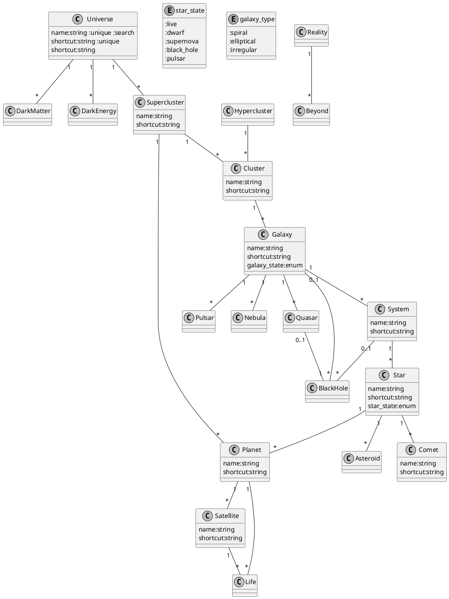

```plantuml
@startuml

skinparam monochrome true
skinparam shadowing false

class Universe {
  name:string :unique :search
  shortcut:string :unique
  shortcut:string
}

class Supercluster {
  name:string
  shortcut:string
}

class Cluster {
  name:string
  shortcut:string
}

class Galaxy {
   name:string
   shortcut:string
   galaxy_state:enum
}

class System {
  name:string
  shortcut:string
} 

class Star {
  name:string
  shortcut:string
  star_state:enum
}

class Planet {
  name:string
  shortcut:string
}

class Comet {
  name:string
  shortcut:string
}

class Satellite {
  name:string
  shortcut:string
}

enum star_state {
  :live
  :dwarf
  :supernova
  :black_hole
  :pulsar
}

enum galaxy_type {
  :spiral
  :elliptical
  :irregular
}
Supercluster "1" -- "*" Planet
Hypercluster "1" -- "*" Cluster

Supercluster "1" -- "*" Cluster
Star "1" -- "*" Comet

Universe "1" -- "*" Supercluster
Cluster "1" -- "*" Galaxy

System "1" -- "*" Star

Galaxy "1" -- "*" System
Galaxy "1" -- "*" Pulsar
Galaxy "1" -- "*" Nebula
Galaxy "1" -- "*" Quasar

Galaxy "0..1" -- "*" BlackHole
Quasar "0..1" -- "1" BlackHole
System "0..1" -- "*" BlackHole

Universe "1" -- "*" DarkMatter
Universe "1" -- "*" DarkEnergy

Planet "1" -- "*" Life
Satellite "1" -- "*" Life

Star "1" -- "*" Planet
Star "1" -- "*" Asteroid

Planet "1" -- "*" Satellite

Reality "1" -- "*" Beyond
@enduml
```
